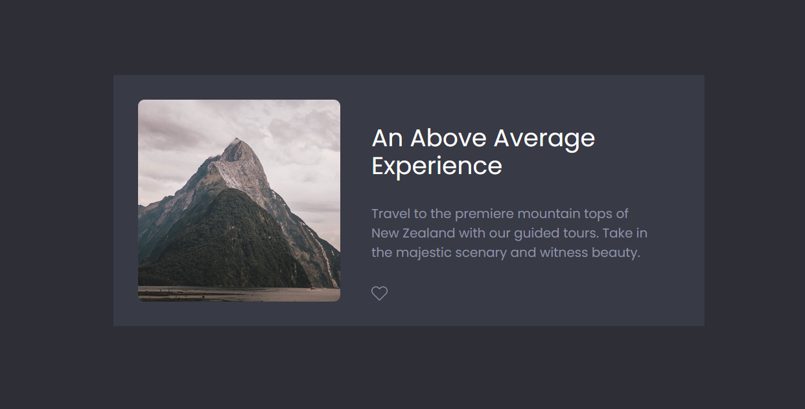
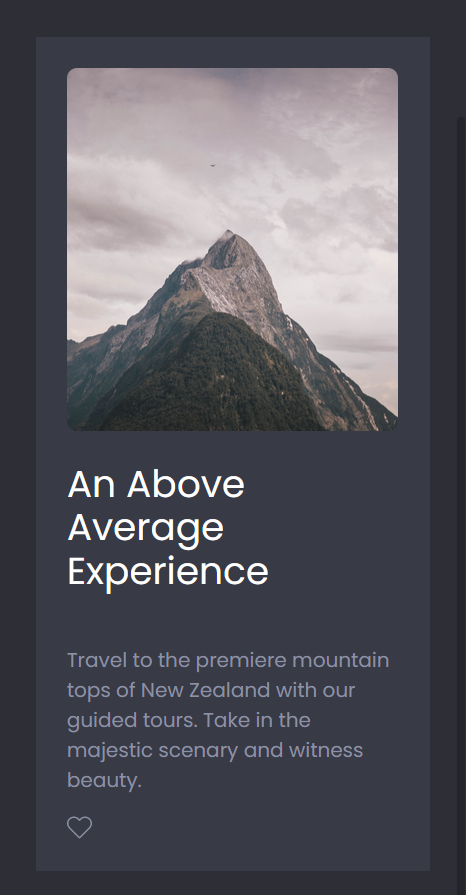

# figma-to-code-project1

## Overview
A simple responsive card element with like button functionality. This is my interpretation for the 1st project/challenge found in the ["From Figma to Code" course by Gary Simon.](https://scrimba.com/learn/figmatocode) I accomplished this challenge using flexbox. I also replaced the share button with a like button and added some basic javascript to interact with the like button.

## Desktop

## Phone

